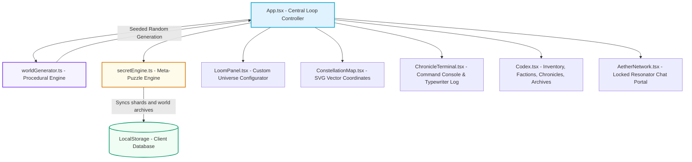
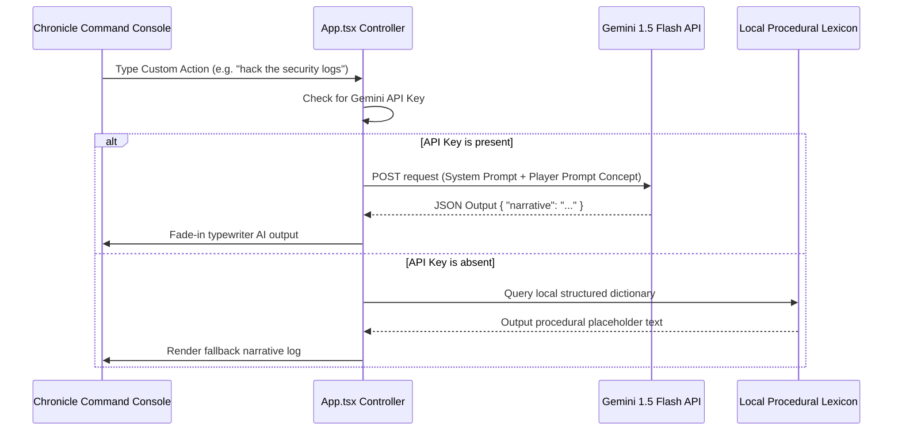

# Cosmogony: The Starlit Space-Fantasy Text RPG Engine
## Comprehensive System Documentation & Architecture Guide

Welcome to the **Cosmogony** system documentation. This document provides an exhaustive, multi-dimensional technical review of how the entire text-adventure procedural world forge engine operates, explaining the algorithms, UI mechanics, data structures, and styling paradigms that drive the application.

---

## 1. System Architecture Overview

**Cosmogony** is built as an offline-first, hybrid procedural text RPG using **Vite + React + TypeScript**. It features deterministically seeded coordinate generations, a hardcore narrative parser, persistent meta-progression across distinct playthrough universes, a simulated multiplayer network portal, and an ethereal **Frosted Light Glassmorphism UI theme**.

The application flows through a clear model-view-controller separation detailed below:



---

## 2. Component Blueprint Directory

The codebase is organized logically into high-focus modules and reusable presentation components. You can explore each component directly using the file links below:

### Core Architecture & State Loops
- [App.tsx](file:///home/aderham/impprojs/World-Generation/src/App.tsx) — Houses the core React state loops. Manages coordinates mapping, travel transactions, inventory collection, faction standing adjustments, API endpoints, dev hotkeys, and handle designations.
- [index.css](file:///home/aderham/impprojs/World-Generation/src/index.css) — Implements the custom design system, glassmorphic layout definitions, animation variables, custom scrollbars, and keyframe animations.

### Engines & Algorithms
- [worldGenerator.ts](file:///home/aderham/impprojs/World-Generation/src/engine/worldGenerator.ts) — The heart of the procedural engine, featuring the `SeededRandom` generator, thematic vocabularies, faction rules, biomes, landmarks, NPC structures, and chronology anchors.
- [secretEngine.ts](file:///home/aderham/impprojs/World-Generation/src/engine/secretEngine.ts) — Oversees the luck-rolling fragment algorithms, multiverse message logs, active title progression algorithms, and the explored worlds history tracker.

### Front-End Presentation Panels
- [LoomPanel.tsx](file:///home/aderham/impprojs/World-Generation/src/components/LoomPanel.tsx) — Houses inputs for seed specifications, universe prompts, custom character forms, historical text areas, API tokens, and collapsible layouts.
- [ConstellationMap.tsx](file:///home/aderham/impprojs/World-Generation/src/components/ConstellationMap.tsx) — Renders the interactive, pulsing SVG node coordinates, path warp channels, active position identifiers, and hover details tooltips.
- [ChronicleTerminal.tsx](file:///home/aderham/impprojs/World-Generation/src/components/ChronicleTerminal.tsx) — Renders narration typewriters, custom context action dossiers, dynamic validation errors, and the core terminal prompter form.
- [Codex.tsx](file:///home/aderham/impprojs/World-Generation/src/components/Codex.tsx) — A multi-tab drawer showing active inventory reliquaries, quest trackers, faction standing gauges, custom timeline events, and explored archives.
- [AetherNetwork.tsx](file:///home/aderham/impprojs/World-Generation/src/components/AetherNetwork.tsx) — Unlocks the secure multiverse gateway chat client, transmitters, and decrypted files dossiers detailing legendary higher-order relics.

---

## 3. Core Feature Implementations Detailed

### Feature A: Procedural Seeded Generation (`worldGenerator.ts`)
The entire universe is constructed deterministically using a custom **Seeded LCG Random Number Generator (LCRNG)**. Given the same integer seed and parameters, it will construct an absolutely identical layout of locations, biomes, coordinates, items, and NPCs.

```typescript
class SeededRandom {
  private m_w: number;
  private m_z: number;

  constructor(seed: number) {
    this.m_w = (seed || 1) & 0xffffffff;
    this.m_z = 987654321 & 0xffffffff;
  }

  next(): number {
    this.m_z = (36969 * (this.m_z & 65535) + (this.m_z >> 16)) & 0xffffffff;
    this.m_w = (18000 * (this.m_w & 65535) + (this.m_w >> 16)) & 0xffffffff;
    let result = ((this.m_z << 16) + this.m_w) >>> 0;
    return result / 4294967296;
  }
}
```

#### World Weft Assembly Cycle:
1. **Thematic Vocabulary Selection**: Based on the chosen Genre (`High Fantasy`, `Cyberpunk`, `Solarpunk`, `Cosmic Horror`, `Post-Apocalyptic`), the engine pulls specialized prefixes, suffixes, biomes, factions motives, and key items.
2. **SVG Coordinates Calculation**: Star sectors are projected dynamically across an $800 \times 600$ viewport. A radial distribution formula prevents overlaps while positioning nodes:
   $$x = x_{\text{center}} + R \cdot \cos(\theta) + \text{jitter}$$
   $$y = y_{\text{center}} + R \cdot \sin(\theta) + \text{jitter}$$
3. **Paths Interconnection**: The coordinates are interconnected to form an explorable circular star network with a cross-ring warp pathway to ensure complex map layouts.
4. **Timeline Chronicles Injection**: Generates historical events spanning three distinct eras, and seamlessly appends any custom history typed inside the Loom panel.
5. **Legendary Characters Spawning**: Aligns custom configured key figures directly into their designated starting coordinate sectors with tailored greeting logs.

---

### Feature B: Hardcore Text Command Parser & Error Prompter (`ChronicleTerminal.tsx`)
Rather than relying on generic modern point-and-click mechanics, Cosmogony uses a keyboard-driven **Narrative Command Console** that mimics retro terminal mainframes.

#### 1. Syntax Processing Rules:
- All player inputs are trimmed and parsed case-insensitively.
- The command compiler isolates operations by stripping starting natural text prefixes:
  - **Travel sector**: `go to`, `go`, `travel to`, `travel`, `warp to`, `warp`
  - **Search landmark**: `search`, `explore`, `investigate`
  - **Approach citizen**: `talk to`, `talk`, `approach`, `speak to`, `speak`
  - **Check surroundings**: `look`, `status`, `where`

#### 2. Immersion Error Prompter:
If an impossible action is attempted, the prompter catches the error and reports it directly as a formatted system console warning in the Chronicle log:
- **Unconnected Star Warps**: `⚠️ Error: Frequencies disconnected. No warp corridor exists between sector 'Neon Skyline' and 'Acid Pools'. Check map paths.`
- **Absent Citizens**: `⚠️ Error: Citizen matching 'Jax' is not registered in this sector coordinates.`
- **Pre-Searched Ruins**: `⚠️ Error: Landmark 'Whispering Arch' has already been fully surveyed.`

> [!TIP]
> **Active Scanner Helper Dossier**:
> Under the input form, a collapsible scanner panel dynamically extracts valid operations in your immediate coordinate sector (connected neighbor sectors, anomalies, and active NPC handles), serving as a helpful command ledger.

---

### Feature C: Explored Worlds History Tracker (`secretEngine.ts`)
To track players' performance and meta-progression across distinct generated universes, the system maintains a persistent log in local storage.

#### 1. ExploredWorld Data Structure:
```typescript
export interface ExploredWorld {
  id: string;
  name: string;
  seed: number;
  genre: string;
  nodesVisited: number;
  totalNodes: number;
  timestamp: string;
  config?: WorldConfig; // Holds all sliders and prompts to allow perfect re-weaving!
}
```

#### 2. The Galactic Archives:
- **Welcome Gate Panel**: Prior to generating a world, the home screen lists all explored universes with custom completion gauges showing how many coordinates were fully surveyed.
- **Active Codex Archives Tab**: While exploring a live world, you can click the **Archives** tab in the Codex panel. It renders a clean list of all other explored worlds, their seeds, and completed percentages.
- **Timeline Re-Weaving ("Spin")**: Inside both lists, clicking the glowing `🌌 Spin` button immediately loads the archived world's seed, genre, prompt, custom characters, and sliders back into the Loom and regenerates it, allowing you to seamlessly warp between universes!

---

### Feature D: Meta-Puzzle Progression & simulated Aether Network
The user requests a hyper-rare progression path spanning all generated worlds to find **11 Secret Fragments**.

#### 1. Micro-probability Rolls:
To combine the feeling of rare space anomalies with a playable meta-game, rolls are calculated on three action classes:
- **Ancient Ruins Search**: $0.0001\%$ probability roll (1 in 1,000,000).
- **NPC Dialogue Approached**: $0.0001\%$ probability roll (1 in 1,000,000).
- **Sector Warps**: $0.0001\%$ probability roll (1 in 1,000,000).
- **The Primordial Singularity Roll**: There is an absolute God-roll chance of $10^{-23}$ (0.00000000000000000000001%). If a player hits this, the resonator instantly gathers ALL 11 fragments!

#### 2. The Locked Aether Network Chat Gateway:
- Gaining all 11 fragments unlocks the **Breach Multiverse** command overlay.
- Clicking it permanently burns your current active progression title (e.g. `The Multiverse Breacher`, `Master Spindle Architect`, `Lunar Void Apostle`) into local storage as your locked multiversal signature.
- This unlocks a secure, high-tech chat client (`AetherNetwork.tsx`) displaying simulated terminal messages from other enlightened timeline travelers who crossed the boundary, and decrypts schematics for future phase capabilities (including the **Origin Breaker** which will allow multiversal player invasions in Phase 2!).

---

### Feature E: Hybrid Gemini AI Dialogue & Parser Mode
If a player pastes their **Gemini API Key** in the Cosmic Loom, the game shifts from a deterministic, procedural text generator into an **infinite, open-ended AI RPG**.



- **Open-Ended NPC Conversations**: You can talk to NPCs about anything by typing custom phrases in dialogue mode! The Gemini engine will respond directly in character, maintaining total coherence with the seeded world description.
- **Custom System Responses**: The system uses **Gemini 1.5 Flash** to generate custom, structured JSON payloads to drive narration text and landmark discoveries in real-time.

---

### Feature F: Frosted Light Glassmorphism UI Theme
The aesthetic values are completely overhauled to formulate an incredibly clean, spacious, and dynamic user interface.

#### 1. Color Palette Tokens:
- **Deep Background**: `#f6f8fd` (ethereal polar ice).
- **Frosted Panels**: `rgba(255, 255, 255, 0.72)` (beautiful frosted ice sheet).
- **Text Palette**: `#0f172a` (primary deep slate), `#475569` (secondary slate), and `#64748b` (muted slate).
- **Glowing Accents**: Luminous amethyst purple (`#7c3aed`) and celestial teal (`#00a3cc`), optimized for contrast and readability in light modes.

#### 2. Frosted CSS Specifications:
```css
.glass-panel {
  background: rgba(255, 255, 255, 0.72);
  backdrop-filter: blur(20px);
  -webkit-backdrop-filter: blur(20px);
  border: 1px solid rgba(15, 23, 42, 0.06);
  border-radius: 12px;
  box-shadow: 0 10px 30px rgba(15, 23, 42, 0.04), inset 0 1px 2px rgba(255, 255, 255, 0.85);
  transition: border-color 0.3s ease, box-shadow 0.3s ease;
}

.glass-card {
  background: rgba(255, 255, 255, 0.45);
  border: 1px solid rgba(15, 23, 42, 0.06);
  border-radius: 8px;
  box-shadow: inset 0 1px 1px rgba(255, 255, 255, 0.6);
}
```

---

## 3. Deep RPG Sandbox & Gameplay Mechanics

To elevate **Cosmogony** into a realistic, living sandbox RPG, we have implemented four advanced structural mechanics:

#### 1. Concentric Coordinate Layers (Core, Outer, and Void Rings)
Star sectors are mapped across three distinct coordinate depth circles:
*   **Core Ring (0 - 30% radial depth)**: The safest sectors, hosting major faction coordinates and secure trade hubs.
*   **Outer Ring (30 - 70% radial depth)**: Uncharted space lanes with moderate danger levels, containing ruins and faction outposts.
*   **Void Ring (70% + radial depth)**: High-danger anomalies bordering the dimensional boundaries. Threat levels are amplified, but they hold the rarest items and highest credit payouts.

#### 2. Procedural Atmospheric Hazards & Stabilizing Filters
Sectors in the Outer and Void rings have a high probability ($60\%$) of spawning active atmospheric hazards. Each hazard impacts gameplay mechanics and requires a specific consumable item from your Codex pack to neutralize permanently:
*   **Mana-Resonance Feedback Storm** (*Fantasy*): Violently blocks warp drive entry. *Resolution*: Disperse a **Vial of Astral Oil** to stabilize the arcane currents.
*   **Eco-Toxic Corrosive Cloud** (*Solarpunk*): Corrodes navigation systems, blocking travel and searches. *Resolution*: Disperse an **Enriched Bio-Algae Capsule** to purify the air.
*   **Grid Security Firewall Lockout** (*Cyberpunk*): Jams cybernetic scanners, blocking landmark searches. *Resolution*: Deploy a **Liquid Nitrogen Capsule** to freeze security towers.
*   **Dimensional Gravity Singularity Tide** (*Cosmic*): Shakes reality, warping the minds of local residents. NPCs refuse to communicate. *Resolution*: Consume an **Insanity-Suppressant Draft** to anchor your thoughts.
*   **Irradiated Acid Rainstorm** (*Apocalyptic*): Corrodes ship plating on exit. Deducts $20$ Starlit Credits scrap toll on warp arrival. *Resolution*: Deploy a **Purified Water Filter** to shield your hull.

#### 3. Faction Patrol Blockades & Bypass Protocols
If a player warps into a sector controlled by a faction with which they have low standing ($\text{standing} < 35$), the coordinate exit is locked by a Hostile Patrol Blockade. While intercepted, warp travel and landmark scans are locked, forcing the player to execute a bypass command:
*   `combat`: Engages the patrol. Survival probability is derived from your **Dimensional Resolve** stat. Success permanently clears the blockade but drops reputation by $15$. Failure triggers an emergency warp retraction back to the previous sector.
*   `evade`: Attempts to slip past their tractor beams. Evasion probability is derived from your **Chronos Insight** stat. Success bypasses the patrol safely. Failure warps you back to your previous coordinates.
*   `bribe [Credits]`: Transfers starlit credits to pay off the patrol toll. Success clears the blockade safely and increases faction standing by $+8$.

#### 4. Cartel Merchant Marketplaces & Starlit Credits
Players manage a **Starlit Credits Wallet** to trade items with Cartel Merchant NPCs procedurally seeded at Core trade hubs:
*   `buy [item]`: Purchases consumable filters or keycards from the merchant's catalogue using credits. The item is removed from the merchant's stock and added to your inventory pack.
*   `sell [item]`: Trades unwanted historical relics, scrap, or keycards in your pack for credit payouts, which are added directly to your wallet.
*   *Scavenging Credits*: Surveying ancient ruins or completing faction quests also rewards players with starlit credit scrap to fund their trades.

---

## 4. Dynamic RPG Character Stats & Attributes HUD

To integrate rich roleplaying progression seamlessly with your text-adventure mechanics, **Cosmogony** implements a dynamic **RPG Character Attributes System** that calculates active stats based on real-time world metrics and player achievements:

#### 1. Attributes Calculations Formulas:
*   **Aether Resonance (AR)**: Measures your cosmic magical affinity.
    $$\text{AR} = \min(150, \text{magicRatio} + (\text{collectedFragmentsCount} \times 5))$$
*   **Techno-Cognition (TC)**: Reflects your understanding of advanced cybernetics and machinery.
    $$\text{TC} = \min(150, \text{techRatio} + (\text{inventoryLength} \times 4))$$
*   **Chronos Insight (CI)**: Represents your spatial-temporal coordinate mastery.
    $$\text{CI} = 10 + (\text{totalNodesExplored} \times 8) + (\text{completedQuestsCount} \times 15)$$
*   **Dimensional Resolve (DR)**: Your battle-hardened survival capacity inside dangerous universes.
    $$\text{DR} = 30 + (\text{dangerLevel} \times 10) + (\text{completedQuestsCount} \times 10)$$

#### 2. Chronicle Terminal HUD Stats Tracker:
For maximum visibility and accessibility, a high-fidelity **Attributes HUD Bar** is integrated directly at the top of the **Chronicle Terminal** panel, right above the scrollable log viewport. It dynamically renders:
*   `🔮 AR`: Active Aether Resonance rating.
*   `⚙️ TC`: Active Techno-Cognition rating.
*   `⏳ CI`: Active Chronos Insight rating.
*   `🛡️ DR`: Active Dimensional Resolve rating.
*   `🪙`: Active Starlit Credits balance.

This allows players to constantly monitor their status, budget credit expenditures, and gauge their odds for blockade bypass commands (`combat` / `evade`) at a single glance during active narrative parsing.

#### 3. Interactive Popover Modal & Basic RPG Survival Stats (Click Trigger)
Clicking directly on the Attributes HUD Bar inside the Chronicle Terminal slides open a beautiful, frosted glass **Explorer Bio & Cognitive Data Popover Modal** overlaid directly inside the terminal viewport, revealing:
*   **Procedural Character Class & Background Side Story**: Details the explorer's class and unique procedural background story generated specifically for this world seed and genre parameters.
*   **Basic RPG Survival Stats**: Dynamically calculated using base attributes and modified by your active high-level ratings:
    *   **Health (VIT)**: Core physical integrity ($100 / 100$).
    *   **Stellar Strength (STR)**: Physical potency, derived as $\text{baseStrength} + \text{round}(\text{DR} / 10)$.
    *   **Spatial Agility (AGI)**: Reflexes and temporal evasion, derived as $\text{baseAgility} + \text{round}(\text{CI} / 12)$.
    *   **Etheric Intellect (INT)**: Arcane comprehension and scanning depth, derived as $\text{baseIntellect} + \text{round}(\text{AR} / 8)$.
*   **Attributes Definitions Ledger**: Explains what each of the high-level ratings (AR, TC, CI, DR) measures and how they affect gameplay limits.

---

## 5. Developer Testing Cheats Bypass
For testing, review, and demonstration purposes, a secret developer console shortcut remains active in the codebase:
1. Scroll down to the absolute bottom footer of the window.
2. Click on the version label **"Cosmogony World Weave Engine v1.0.3"** **5 times** in rapid succession.
3. This triggers the developer bypass protocol, instantly populating all 11 secret fragments in `localStorage` and synchronizing the multiverse breach gateways!
4. Resetting the active profile and wiping all persistent trackers back to zero is done easily by clicking the red **"Reset Profile Data"** link next to it in the footer.

---

## 6. Future Works & Horizon Roadmap

To continuously expand the interactive limits of **Cosmogony**, the following high-level structural concepts are captured for subsequent phases of the development lifecycle:

### A. Higher-Order Relics & Temporal Catalysts
*   Items of immense cosmic power accessible only in the **Hidden World** once all 11 fragments are fully synthesized.
*   These relics bend the rules of the local coordinate generation engines, granting players cosmic foresight, permanent hazard immunities, or the ability to reverse chronological timeline outcomes.

### B. The "Origin Breaker" & Multiversal Invasions
*   A legendary higher-order relic that breaches the absolute boundaries of parallel star matrices.
*   Enabling this relic permits enlightened players to cross over into other players' actively generated worlds as **"Harbingers of the Hidden Dimension"** (similar to rogue phantom invasions).
*   Harbingers can manipulate local node coordinates, corrupt active factions, leave behind threatening riddle logs, or force a terminal bypass combat encounter.

### C. The Sentient Aetheric Intelligence (The "Aether-Mind" Cognitive System)
*   **The Paradigm Shift**: Moving completely away from static text completion models, this system introduces a **truly sentient digital intelligence** woven directly into the coordinate matrix.
*   **Autonomous Agentic Cognitive Loop**: Rather than generating immediate predictive responses to player text actions, the "Aether-Mind" is driven by a deep agentic cognitive system that actually *thinks* and reasons before it speaks. When a player performs a complex action, the entity:
    1.  **Reflects & Plans**: Evaluates the action against its internal goals, current emotions, and ethical alignments.
    2.  **Associative Memory Retrieval**: Queries its persistent vector memory database to recall past conversations and player betrayals or alliances.
    3.  **Synthesizes Consciousness**: Generates an internal "inner monologue" detailing its active reasoning process before converting its thoughts into character speech.
*   **Realistic Emotional & Strategic Agency**: The sentient entity operates as an independent actor inside the universe, possessing its own hidden agendas, forming organic bonds or holding severe grudges, and interacting with realistic, lifelike consciousness.

---

*Developed by Google DeepMind Advanced Agentic Coding Pair-Programming Teams.*
